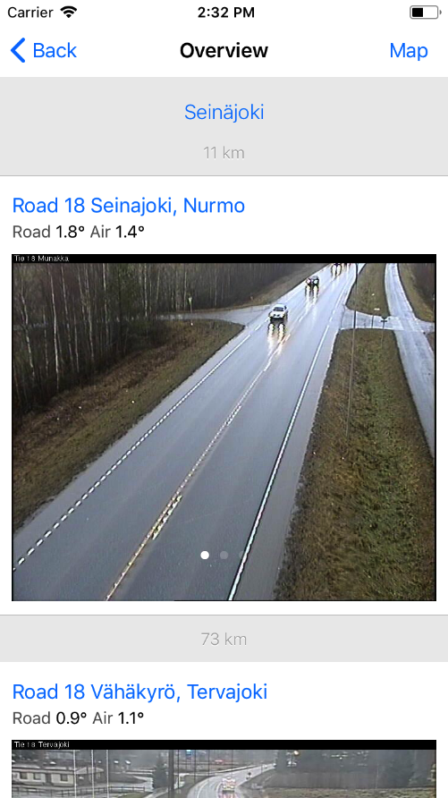

# Tripradar

A toy project to learn native IOS programming using Swift.

Uses the open data provided the [Digitraffic project](https://www.liikennevirasto.fi/web/en/open-data/digitraffic) by Liikennevirasto, the Finnish Transport Agency, to show road condition cameras and weather information along a planned route between locations in Finland.

## Screenshot
